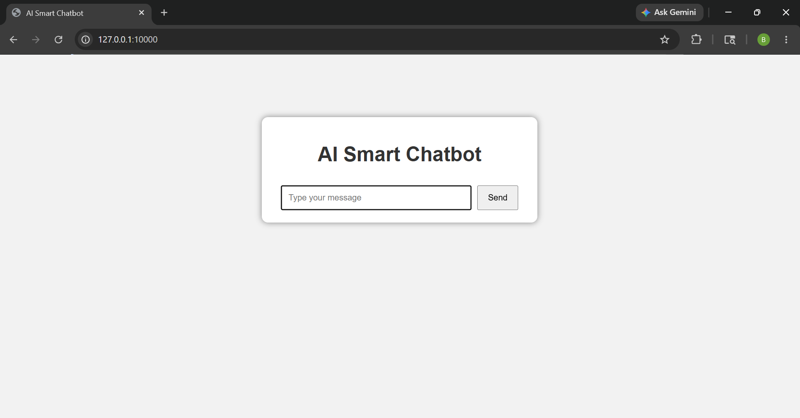
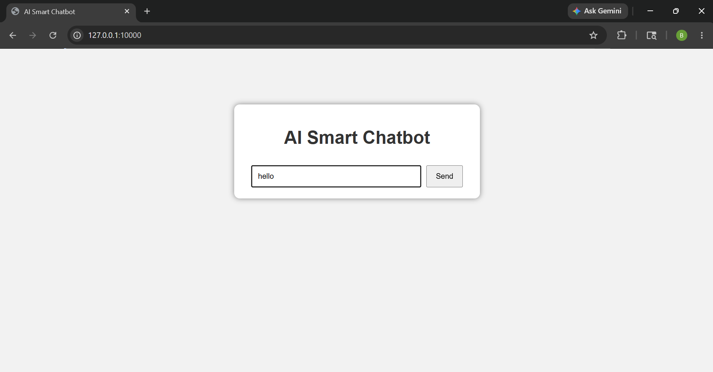
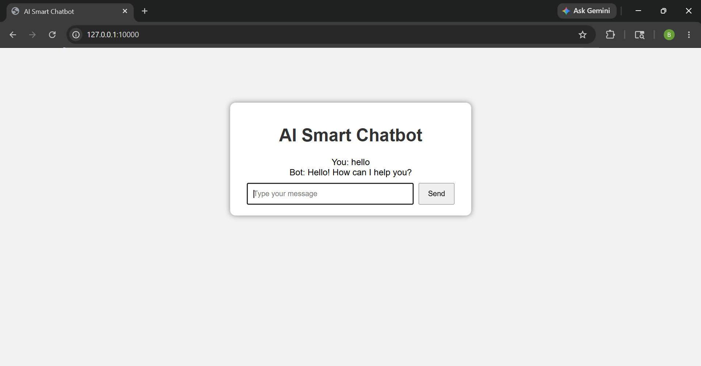

# AI-Based Smart Chatbot

## About
AI-Based Smart Chatbot is a web-based chatbot application built using Python and Flask. It uses a rule-based keyword matching system to understand user input and respond with appropriate replies. The project demonstrates full-stack development using Flask for backend and HTML, CSS, JavaScript for frontend integration.

This project demonstrates basic Natural Language Processing concepts using a rule-based approach for intent recognition and response generation.

---

## Technologies Used

Frontend:
- HTML
- CSS
- JavaScript

Backend:
- Python
- Flask

---

## Libraries Used
- Flask
- JSON (for intent data handling)
- Random (for selecting responses)

---

## How to Run

1. Install Flask:
   pip install flask

2. Run the application:
   python app.py

3. Open browser and use the application locally

---

## Working
User enters a message → chatbot reads keywords from intents.json → matches intent → selects response → displays output in chat interface.

The chatbot uses keyword matching to map user input to predefined intents stored in JSON format.

---

## Screenshots

### Home Page

### Chat Input

### Bot Response

---

## Future Improvements
- Integrate AI/ML based NLP model
- Improve UI design with modern chat interface
- Add database for chat history storage
- Deploy application for public access
- Add voice-based interaction system

---

## Project Status
Currently running in local environment using Flask. Deployment is not included as the project is intended for local demonstration.

---

## Author
Developed by Badarla Lihesh